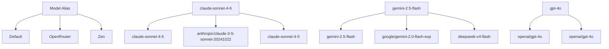

# Antigravity Proxy

<p align="center">
  
</p>

<h1 align="center">Antigravity Proxy</h1>

<p align="center"><strong>Use any AI provider</strong> with <strong>Antigravity 2.0</strong> — NVIDIA, OpenRouter, OpenAI, Groq, Anthropic, Google Gemini, OpenCode Zen, or 9+ local inference solutions.</p>

<p align="center">
  <a href="https://github.com/12errh/antigravity-proxy/actions/workflows/ci.yml">
    
  </a>
  =20">
  
  
</p>

The proxy intercepts Antigravity's Google Gemini API calls and translates them to the target provider's format. It supports:

- Multi-provider failover with retry + exponential backoff
- Per-model, per-provider routing via a matrix UI  
- Reasoning effort control
- Real-time hot-reload of all config
- Advanced tool normalization and capability detection

---

## Quick Start

### Prerequisites

- **Antigravity 2.0 Desktop** (Windows, macOS, or Linux)
- **Node.js 20+** 
- **Administrator/root privileges** (port 443; can use 8443 without admin)
- At least one API key or local model server

### Platform Support

| Platform | Status | Notes |
|----------|--------|-------|
| **Windows 10/11** | ✅ Tested | `start.ps1` handles cert install, port binding, and launch |
| **macOS** | ⚠️ Untested | `start.sh` with best-effort cert trust. Report issues on GitHub. |
| **Linux** | ⚠️ Untested | `start.sh` with best-effort cert trust. Report issues on GitHub. |

> TypeScript code is cross-platform. Only launcher scripts and TLS cert trust are platform-specific.

### Launch

**Windows (PowerShell as Administrator)**

```powershell
.\start.ps1
```

**macOS / Linux**

```bash
chmod +x start.sh
./start.sh
```

**Without admin (port 8443)**

```bash
./start.sh --port 8443
```

Then open **http://localhost:4000** in your browser to configure providers, model mappings, and view live stats.

---

## 🎯 Key Features

| Feature | Status | Description |
|---------|--------|-------------|
| **Multi-provider failover** | ✅ | Priority chain with exponential backoff |
| **Per-model routing** | ✅ | One row per model alias, one column per provider |
| **Retry + backoff** | ✅ | Configurable per-provider and global |
| **Hot-reload config** | ✅ | No restart needed for changes |
| **Tool normalization** | ✅ | Alias resolution, type coercion, default filling |
| **Model capability detection** | ✅ | Auto-detect reasoning, vision, tools |
| **Provider optimizations** | ✅ | Groq (image stripping), Zen/NVIDIA (reasoning effort) |
| **Real-time dashboard** | ✅ | Live logs, stats, config editor |
| **Cost tracking** | ✅ | Per-day, per-model, per-provider |
| **Local discovery** | ✅ | 9+ inference solutions auto-detected |
| **Full-text search** | ✅ | Search requests, sessions, logs |
| **Blocklist** | ✅ | Provider, model, content filtering |
| **Session comparison** | ✅ | Side-by-side session analysis |

---

## 🚀 How It Works

```mermaid
flowchart LR
    A[Antigravity 2.0 Desktop] --> B[TLS 443]
    B --> C[Proxy (TypeScript)]
    C --> D[Provider API]
    C --> E[Dashboard HTTP 4000]
    D --> F[OpenRouter]
    D --> G[NVIDIA NIM]
    D --> H[OpenAI]
    D --> I[Groq]
    D --> J[Anthropic]
    D --> K[Google Gemini]
    D --> L[Zen]
    D --> M[Ollama]
    D --> N[vLLM]
    D --> O[LM Studio]
    D --> P[llama.cpp]
    D --> Q[text-generation-webui]
    D --> R[TabbyAPI]
    D --> S[LocalAI]
    D --> T[LiteLLM]
    D --> U[Aphrodite]
    E --> V[Live logs]
    E --> W[Request history]
    E --> X[Config editor]
    E --> Y[Model matrix]
    E --> Z[Provider priority]
```

### Per Request Pipeline

1. **TLS Intercept** — Receives Gemini API call on port 443
2. **Context Stripping** — Removes bulk context, injects compact `agent-context.md` reference
3. **Tool Normalization** — Resolves aliases, coerces types, fills defaults
4. **Model Resolution** — Routes through priority order with retry + backoff
5. **Capability Detection** — Auto-detects reasoning/vision/tool support
6. **Reasoning Effort** — Applies `reasoning_effort` if configured
7. **Translation** — Converts to target provider's API format
8. **Streaming** — Returns SSE response wrapped in Gemini format
9. **Logging** — Records to SQLite for cost tracking, history, sessions

---

## 📊 Supported Providers

### Cloud APIs

| Provider | Type | Env Var | Notes |
|----------|------|---------|-------|
| **OpenRouter** | Cloud API | `OPENROUTER_API_KEY` | 300+ models in one key |
| **NVIDIA NIM** | Cloud API | `NVIDIA_API_KEY` | Free credits on signup |
| **OpenAI** | Cloud API | `OPENAI_API_KEY` | GPT-4o, o-series |
| **Groq** | Cloud API | `GROQ_API_KEY` | Ultra-fast LPU inference |
| **Anthropic** | Cloud API | `ANTHROPIC_API_KEY` | Claude 3.x / 4.x |
| **Google Gemini** | Cloud API | `GOOGLE_API_KEY` | Gemini 2.5 Pro/Flash |
| **OpenCode Zen** | Cloud gateway | `OPENCODE_API_KEY` | Claude, GPT, Gemini, Grok, Kimi, GLM — one key |

### Local Inference

| Provider | Type | Notes |
|----------|------|-------|
| **Ollama** | Local | Auto-discovered on port 11434 |
| **vLLM** | Local | Auto-discovered on port 8000 |
| **LM Studio** | Local | Auto-discovered on port 1234 |
| **llama.cpp** | Local | Auto-discovered on port 8080 |
| **text-generation-webui** | Local | Auto-discovered on port 5000 |
| **TabbyAPI** | Local | Auto-discovered on port 5000 |
| **LocalAI** | Local | Auto-discovered on port 8080 |
| **LiteLLM** | Local | Auto-discovered on port 4000 |
| **Aphrodite Engine** | Local | Auto-discovered on port 8000 |

---

## 📋 Models Tab — Matrix

The Models tab shows a matrix: one row per Antigravity model alias, one column per provider.



**Features:**
- Double-click any cell to open live model picker
- Column toggles to hide unused providers
- Quick-add buttons (`+ Claude`, `+ Gemini`, `+ GPT`)
- Empty cells use Default value
- Provider logos in filled cells

---

## 🧠 Model Options — Reasoning Effort

Some models support `reasoning_effort` to control thinking depth:

| Model family | Levels |
|--------------|--------|
| DeepSeek R-series | low, medium, high, max |
| NVIDIA stepfun | low, medium, high, max |
| OpenAI o-series | low, medium, high |
| Qwen Thinking, GLM Thinking, Kimi | low, medium, high |

**Auto-detection:** The Model Options tab detects supported models and lets you set levels per model. Settings persist in `proxy/reasoning-effort.json` without restart.

---

## ⚙️ Config Tab — API Keys

| Key | Provider |
|-----|----------|
| `OPENROUTER_API_KEY` | [openrouter.ai/keys](https://openrouter.ai/keys) |
| `NVIDIA_API_KEY` | [build.nvidia.com](https://build.nvidia.com) — free credits on signup |
| `OPENAI_API_KEY` | [platform.openai.com/api-keys](https://platform.openai.com/api-keys) |
| `GROQ_API_KEY` | [console.groq.com/keys](https://console.groq.com/keys) |
| `ANTHROPIC_API_KEY` | [console.anthropic.com/settings/keys](https://console.anthropic.com/settings/keys) |
| `GOOGLE_API_KEY` | [aistudio.google.com/apikey](https://aistudio.google.com/apikey) |
| `OPENCODE_API_KEY` | [opencode.ai/auth](https://opencode.ai/auth) — one key for Claude, GPT, Gemini, Grok, Kimi, GLM |

All keys are hot-reloaded from `.env` — no restart needed.

---

## 🏗️ Architecture

```mermaid
graph TB
    subgraph "antigravity/"
        A[agent-context.md]
        B[start.ps1]
        C[README.md]
        D[CHANGELOG.md]
        E[docs/
            F[SETUP.md]
            G[CONFIGURATION.md]
            H[DEVELOPER.md]
            I[antigravity-v2-analysis.md]
        ]
        J[proxy/
            K[src/
                L[adapters/
                    M[openai.ts]
                    N[anthropic.ts]
                    O[google.ts]
                    P[groq.ts]
                    Q[zen.ts]
                    R[nvidia.ts]
                    S[types.ts]
                ]
                T[adapter.ts]
                U[provider-plugin.ts]
                V[provider-registry.ts]
                W[plugins/
                    X[builtin-plugins.ts]
                ]
                Y[tool-capabilities.ts]
                Z[tool-normalizer.ts]
                AA[model-capabilities.ts]
                AB[router.ts]
                AC[models.ts]
                AD[index.ts]
                AE[engine.ts]
                AF[mapper.ts]
                AG[config.ts]
                AH[provider-cache.ts]
                AI[reasoning-effort.ts]
                AJ[antigravity-context.ts]
                AK[workspace-context.ts]
                AL[auth.ts]
                AM[auth-sessions.ts]
                AN[logger.ts]
                AO[dashboard.ts]
                AP[db.ts]
                AQ[request-store.ts]
                AR[rate-limiter.ts]
                AS[blocklist.ts]
                AT[local-discovery.ts]
                AU[http-pool.ts]
                AV[pricing.ts]
                AW[types.ts]
            ]
            AX[dashboard/
                AY[index.html]
                AZ[login.html]
            ]
            BA[models.json]
            BB[pricing.json]
            BC[reasoning-effort.json]
            BD[blocklist.json]
            BE[.env]
            BF[.env.example]
            BG[certs/
                BH[cert.pem]
                BI[key.pem]
            ]
            BJ[logs/
                BK[rotating logs]
            ]
        ]
    ]
```

---

## 🔧 Environment Variables

```env
# Provider priority (first = primary)
PROVIDER_PRIORITY=openrouter,nvidia,zen

# API keys
OPENROUTER_API_KEY=sk-or-v1-...
NVIDIA_API_KEY=nvapi-...
OPENAI_API_KEY=sk-...
GROQ_API_KEY=gsk_...
ANTHROPIC_API_KEY=sk-ant-...
GOOGLE_API_KEY=AIza...
OPENCODE_API_KEY=sk-...

# Ports
PROXY_PORT=443          # TLS port Antigravity connects to
API_PORT=4000           # Dashboard + REST API port

# Retry & failover
PROXY_RETRIES=3         # Attempts per provider
PROXY_BACKOFF_MS=100    # Initial backoff (doubles each retry)

# Rate limiting (0 = unlimited)
RATE_LIMIT_GLOBAL=0
RATE_LIMIT_PROVIDER=0
RATE_LIMIT_WINDOW_MS=60000

# Logging
LOG_LEVEL=info          # debug | info | warn | error
LOG_MAX_SIZE_MB=10      # Rotate when reached
LOG_MAX_FILES=5         # Keep N rotated files
LOG_MAX_AGE_DAYS=30     # Delete files older than

# Dashboard auth (optional)
DASHBOARD_USER=admin
DASHBOARD_PASSWORD=your_password

# Failover webhook (optional)
FAILOVER_WEBHOOK_URL=https://hooks.example.com/webhook

# Workspace context hardening
WORKSPACE_CONTEXT_ENVELOPE=strict   # off | loose | strict

# Inline context strip mode
CONTEXT_STRIP_MODE=strip            # strip | passthrough
```

---

## 📚 Quick Links

- [Setup Guide](docs/SETUP.md)
- [Configuration Reference](docs/CONFIGURATION.md)
- [Developer Guide](docs/DEVELOPER.md) ← **For adding providers & plugin development**
- [Antigravity v2 Protocol Analysis](docs/antigravity-v2-analysis.md)
- [CHANGELOG](CHANGELOG.md)
- [Contributing](CONTRIBUTING.md)
- [Security Policy](SECURITY.md)

---

## ⚡ Development Quick Start

```bash
cd proxy
npm install            # Install dependencies
npm run build          # Compile TypeScript → dist/
npm run typecheck      # Type-check only
npm test               # Run tests
npm run dev            # Watch mode
```

**New Providers:** See `docs/DEVELOPER.md` for plugin architecture guide.

**Run tests:**

```bash
# All tests
npm test

# Filter by component
npx tsx test/run.ts plugin-architecture
npx tsx test/run.ts tool-translation
npx tsx test/run.ts model-discovery
npx tsx test/run.ts provider-adapters
```

## 📝 License

MIT — see [LICENSE](LICENSE).
